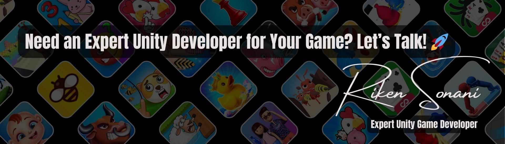

<!-- HEADER BANNER -->

  

# 
👾 Riken Sonani

## 
**Professional Unity Game Developer | AR/VR Specialist**

  <h3>🌟 Top Rated Plus (Top 3%) on Upwork 🌟</h3>
  <h3>🌟 100% Job Success Score 🌟</h3>
  <h3>🌟 9000+ Hours of Professional Experience 🌟</h3>

  
  
  

## 🎮 About Me

Hi! I'm Riken, a Unity game developer ready to bring your game ideas to life. I build games for mobile, VR/AR, and Web3 platforms that run smoothly and keep players engaged.

- 🚀 **Experienced Unity Developer** with many successful games on App Store and Google Play
- 🌐 **Multi-Platform Expert** creating games for Android, iOS, PC, and VR
- 🎯 **Performance Specialist** making sure your games run fast and smooth
- 🔧 **Problem Solver** fixing bugs and improving existing games
- 🌱 Currently working with **Unity XR** to create better VR and AR experiences

## 🛠️ My Services

### 🎮 Game Development

### 🌐 Multiplayer & Web3

### 📱 AR/VR Development

### 🔧 Technical Skills

## 📱 Featured Games

<table>
  <tr>
    <td width="50%">
      <h3 align="center">Pool PayDay</h3>
      

        
        

          
        

        
<strong>Mobile pool game with realistic physics and online play</strong>

      

    </td>
    <td width="50%">
      <h3 align="center">Flick Chess</h3>
      

        
        

          
        

        
<strong>Fun chess game with unique flicking controls</strong>

      

    </td>
  </tr>
  <tr>
    <td width="50%">
      <h3 align="center">XANA</h3>
      

        
        

          
        

        
<strong>Next-gen blockchain game with multiplayer features</strong>

      

    </td>
    <td width="50%">
      <h3 align="center">Line Simulator</h3>
      

        
        

          
        

        
<strong>VR experience available on Steam</strong>

      

    </td>
  </tr>
</table>

## 🌟 Client Reviews

  <table>
    <tr>
      <td>
        
<strong>★★★★★</strong> - "Riken is highly understanding and works efficiently. Great work!"  <em>- Epoxy Studios, Canada</em>

      </td>
      <td>
        
<strong>★★★★★</strong> - "Fantastic developer and wonderful to collaborate with!"  <em>- Random Logic Games, USA</em>

      </td>
    </tr>
    <tr>
      <td>
        
<strong>★★★★★</strong> - "Excellent job fixing the bug in our Unity app!"  <em>- Multimedia Production, Germany</em>

      </td>
      <td>
        
<strong>★★★★★</strong> - "Riken listens and delivers exactly what you need. Will hire again!"  <em>- Josh Nathanson, USA</em>

      </td>
    </tr>
  </table>

## 📊 GitHub Stats

  

## 📫 Contact Me

  
  
  

  

<!-- Footer -->

  <pre>
    <code>
      if (needGameDeveloper) {
        contact("rikensonani96@gmail.com");
        console.log("Let's create an amazing game together!");
      }
    </code>
  </pre>

